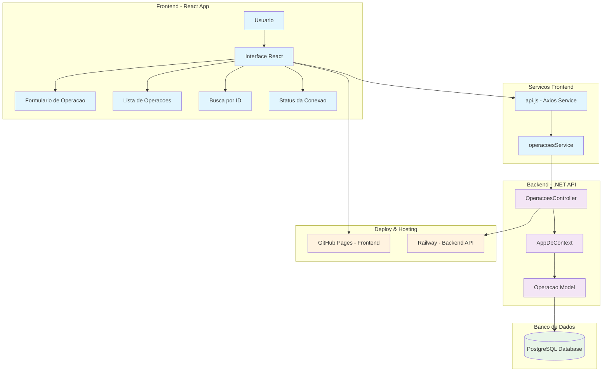
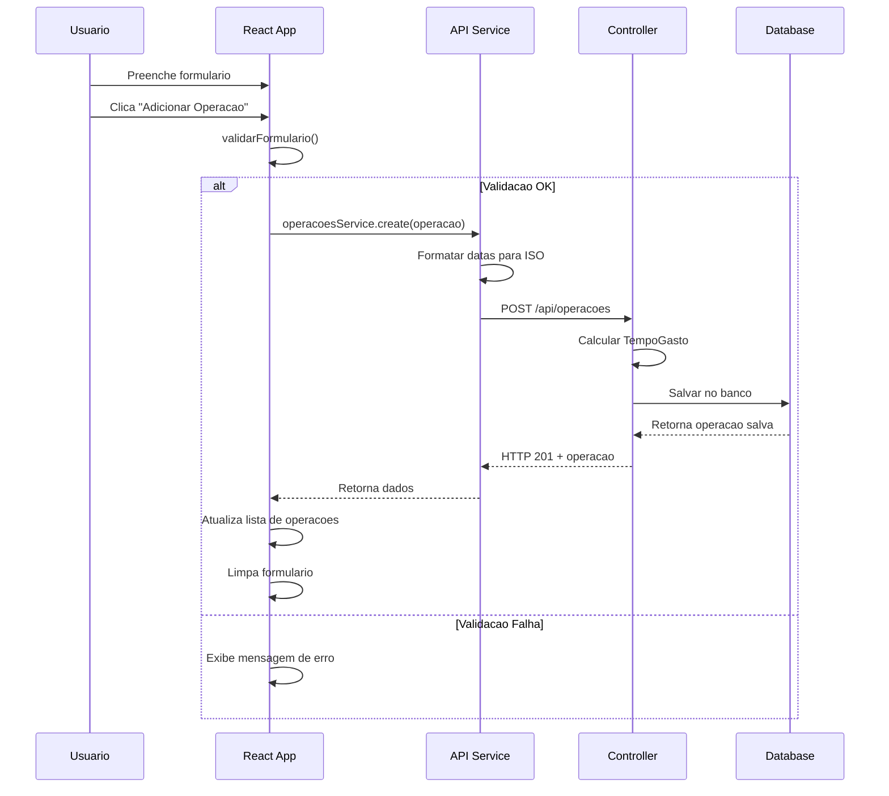
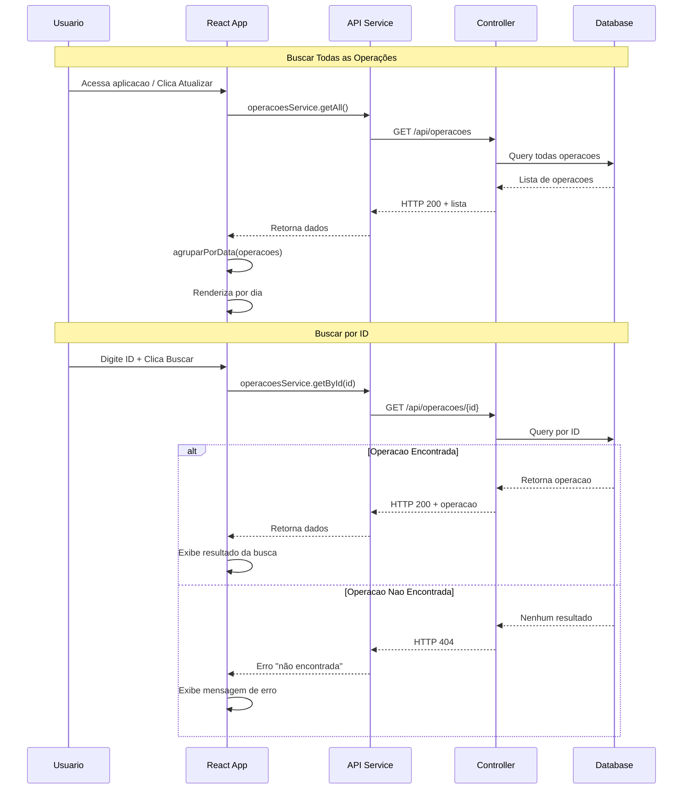
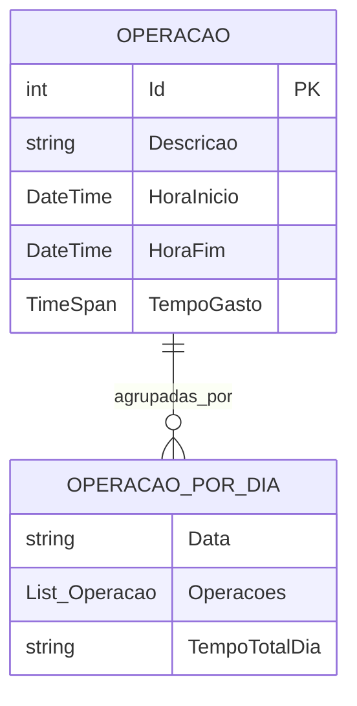
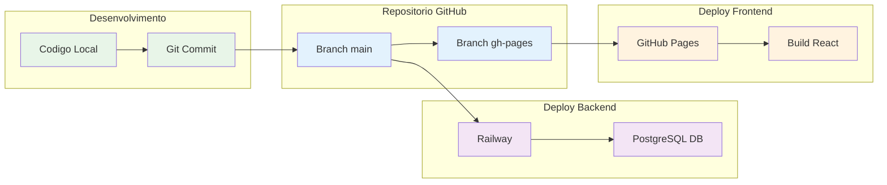
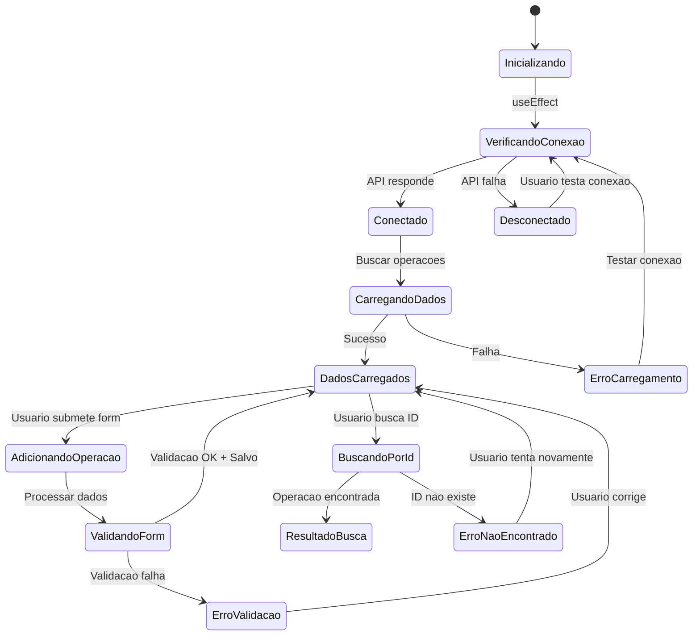
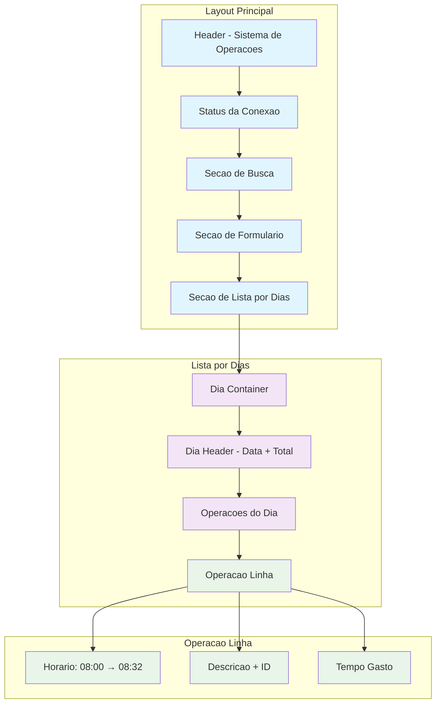

# 📊 Fluxograma do Sistema Work Session Tracker

## 🏗️ Arquitetura Geral do Sistema

## 🔄 Fluxo de Dados - Criar Nova Operação

## 🔍 Fluxo de Dados - Buscar Operações

## 🎨 Estrutura de Componentes Frontend

```mermaid
graph TB
    subgraph "App.js - Componente Principal"
        A1[Estado da Aplicacao]
        A2[useEffect - Inicializacao]
        A3[Funcoes de Validacao]
        A4[Funcoes de Calculos]
    end
    
    subgraph "Secoes da Interface"
        B1[Status da Conexao]
        B2[Busca por ID]
        B3[Formulario de Adicao]
        B4[Lista de Operacoes por Dia]
    end
    
    subgraph "Funcoes Utilitarias"
        C1[testarConexao]
        C2[carregarOperacoes]
        C3[validarFormulario]
        C4[calcularTempoGasto]
        C5[formatarTempo]
        C6[exibirTempoGasto]
        C7[agruparPorData]
        C8[calcularTempoTotalDia]
    end
    
    A1 --> B1
    A1 --> B2
    A1 --> B3
    A1 --> B4
    
    A2 --> C1
    A2 --> C2
    A3 --> C3
    A4 --> C4
    A4 --> C5
    A4 --> C6
    A4 --> C7
    A4 --> C8
    
    classDef component fill:#e3f2fd
    classDef function fill:#f1f8e9
    classDef section fill:#fce4ec
    
    class A1,A2,A3,A4 component
    class C1,C2,C3,C4,C5,C6,C7,C8 function
    class B1,B2,B3,B4 section
```

## 🗄️ Modelo de Dados

## 🚀 Fluxo de Deploy

## 🔧 Estados da Aplicação

## 📱 Estrutura de Interface (Mobile/Desktop)

## 🔄 Ciclo de Vida de uma Operação

```mermaid
graph LR
    A[Usuario preenche dados] --> B[Validacao frontend]
    B --> C[Envio para API]
    C --> D[Validacao backend]
    D --> E[Calculo automatico TempoGasto]
    E --> F[Salvamento no banco]
    F --> G[Retorno para frontend]
    G --> H[Atualizacao da lista]
    H --> I[Reagrupamento por data]
    I --> J[Renderizacao da interface]
    J --> K[Operacao visivel ao usuario]
    
    classDef process fill:#e8f5e8
    classDef validation fill:#fff3e0
    classDef data fill:#f3e5f5
    
    class A,C,G,H,I,J,K process
    class B,D validation
    class E,F data
```

---

## 📋 Resumo dos Componentes

### Frontend (React)
- **App.js**: Componente principal com toda lógica
- **api.js**: Serviço de comunicação com backend
- **index.css**: Estilos responsivos e organizados

### Backend (.NET)
- **OperacoesController**: API REST com CRUD
- **Operacao Model**: Entidade de dados
- **AppDbContext**: Contexto do Entity Framework

### Database
- **PostgreSQL**: Banco relacional na Railway

### Deploy
- **Frontend**: GitHub Pages (branch gh-pages)
- **Backend**: Railway (branch main)
